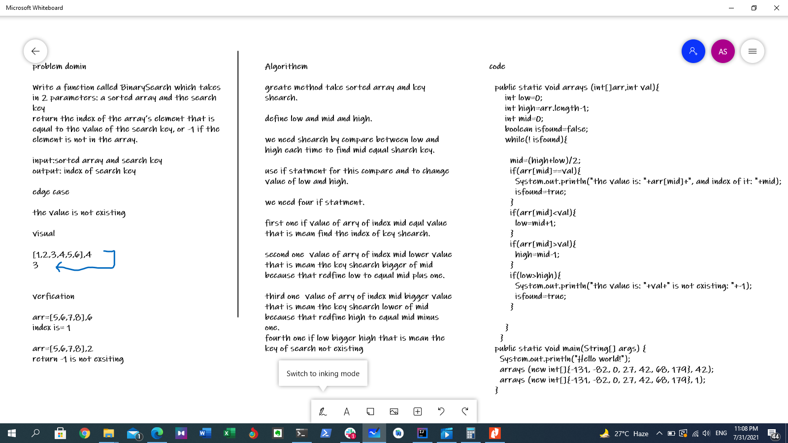

# Binary Search of an Array
Write a function called BinarySearch which takes in 2 parameters: a sorted array and the search key

## Whiteboard Process

## Approach & Efficiency
 I kind of used trial and error, in a computer language.