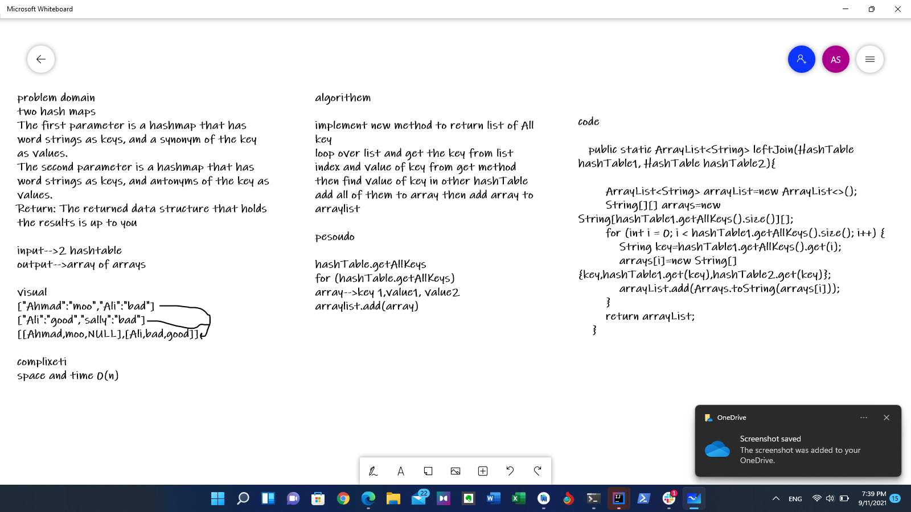

# hashmap-left-join
two hash maps
The first parameter is a hashmap that has word strings as keys, and a synonym of the key as values.
The second parameter is a hashmap that has word strings as keys, and antonyms of the key as values.
Return: The returned data structure that holds the results is up to you

## Whiteboard Process

## Approach & Efficiency

Big0-->time 0(n)
Big0-->space 0(n)