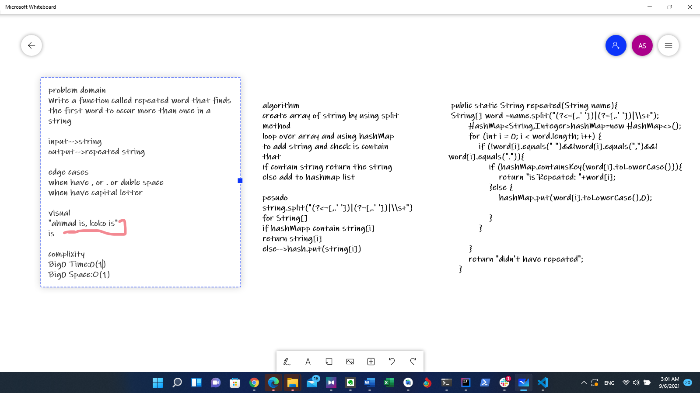

# hashmap-repeated-word
Write a function called repeated word that finds the first word to occur more than once in a string

## edge case
when have , or . or duble space
when have capital letter

## Whiteboard Process

## Approach & Efficiency

Big0-->time 0(1)
Big0-->space 0(1)