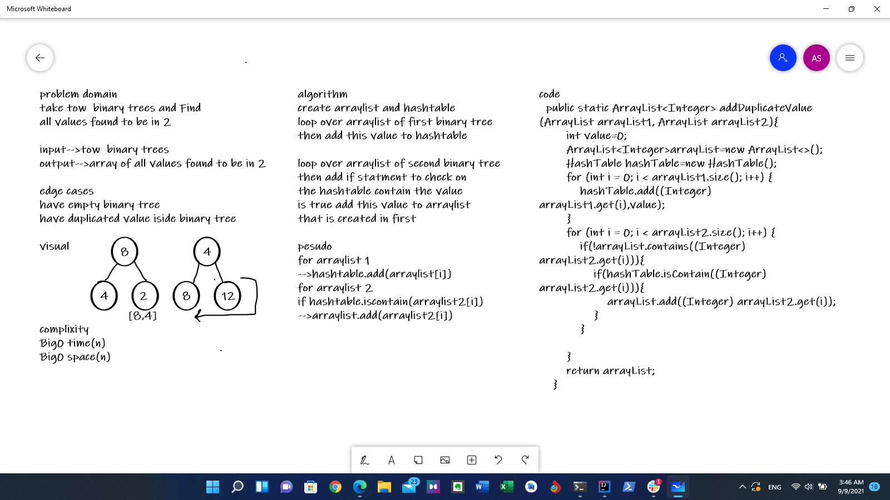

# hashmap-tree-intersection
take tow  binary trees and Find 
all values found to be in 2

## edge case
have empty binary tree

have duplicated value iside binary tree

## Whiteboard Process

## Approach & Efficiency

Big0-->time 0(n)
Big0-->space 0(n)