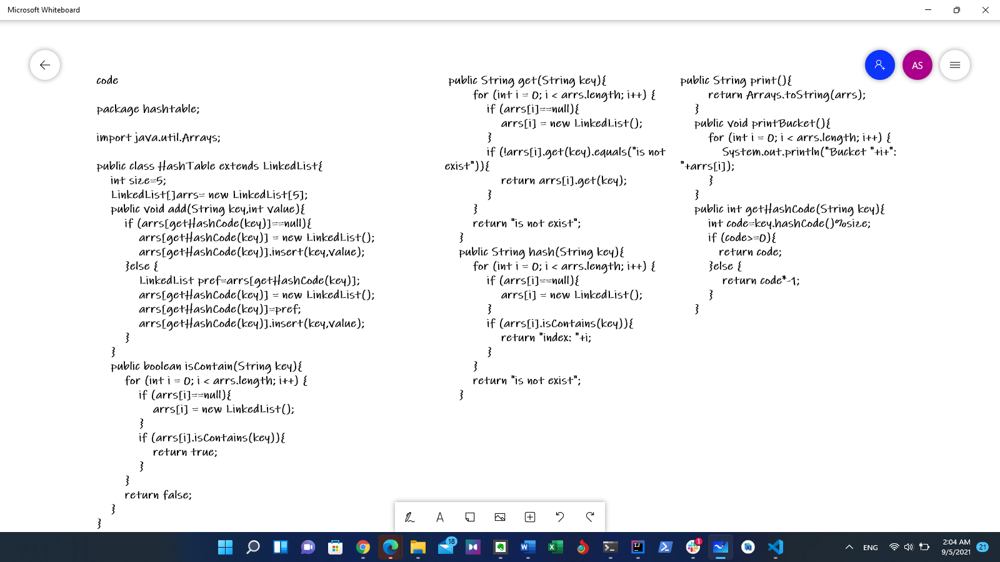
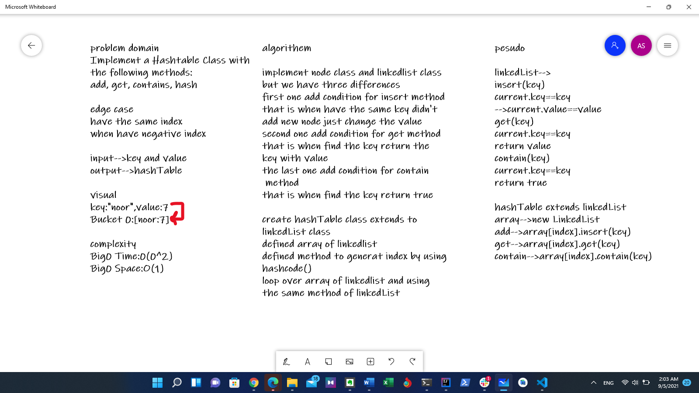

# hashtable
Implement a Hashtable Class with the following methods:
add, get, contains, hash

## edge case
have the same index
when have negative index

## Whiteboard Process

## Approach & Efficiency

Big0-->time0(0^n)
Big0-->space 0(1)