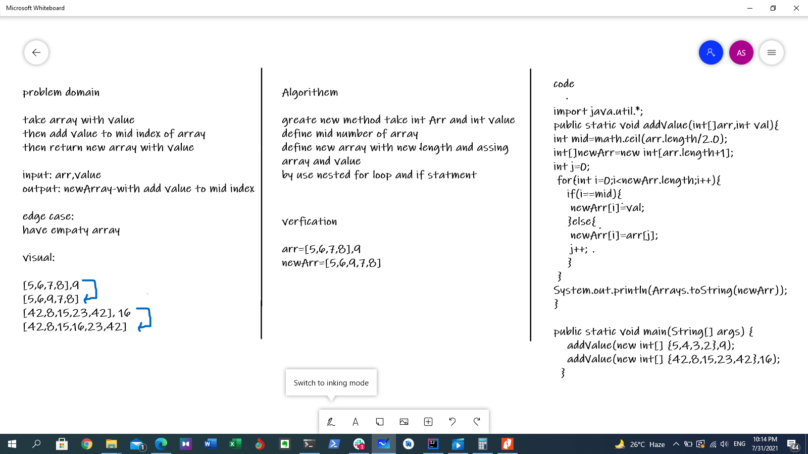

# Insert to Middle of an Array
take array with valuethen add value to mid index of array
then return new array with value

## Whiteboard Process

## Approach & Efficiency
Because we can't change the array's size in Java ,create new array with original leghth +1 then i looped over new array and assigned value of original array with value in middle. 