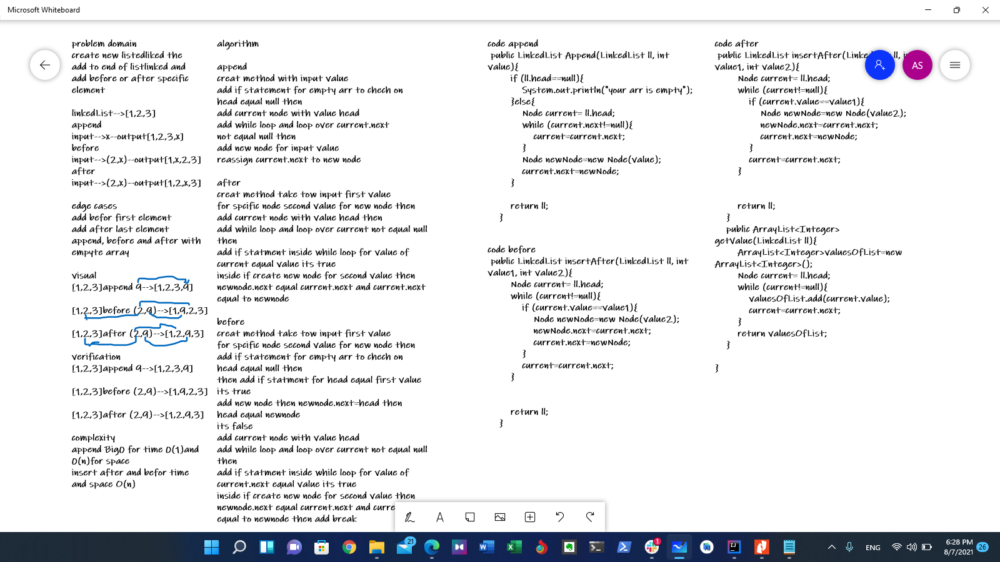

# linked-list-insertions
 add Node to the end of the LinkedList + add a node before and after a specific node(specified by value)

## Whiteboard Process

## Approach & Efficiency
i spent most of the time trying to solve add before method then i solved that
by add breaf to if statment
 
Method append -->Big(O) = O(1) for and O(n) for space

Method insertBefore -->Big(O) = O(n) for space and time

Method insertAfter -->Big(O) = O(n) for space and time