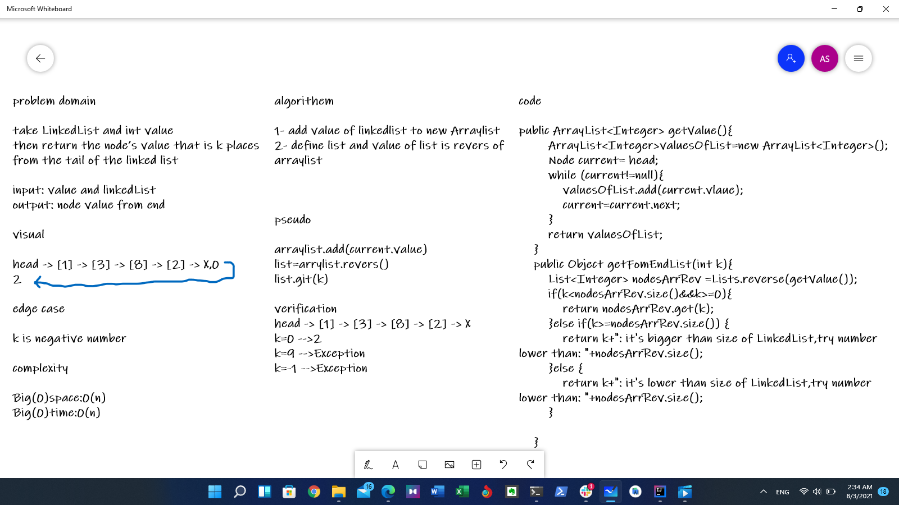

# ll.kthFromEnd(k)
argument: a number, k, as a parameter.
Return the node’s value that is k places from the tail of the linked list.

## Whiteboard Process

## Approach & Efficiency
1- add value of linkedlist to new Arraylist
2- define list and value of list is revers of arraylist 