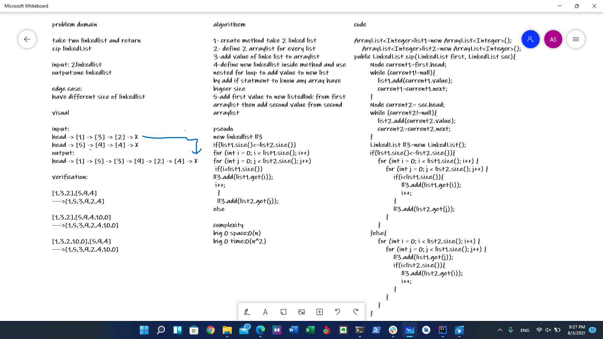

# linked-list-zip
Write a function called zip lists take two linkedlist and return on linkedlist
as show below
- head -> [1] -> [3] -> [2] -> X
- head -> [5] -> [9] -> [4] -> X
- ---->head -> [1] -> [5] -> [3] -> [9] -> [2] -> [4] -> X

## Whiteboard Process

## Approach & Efficiency
1- add every value of linkedlist to new Arraylist

2- add first value to new listedlink from first arraylist then add second value from second arraylist 