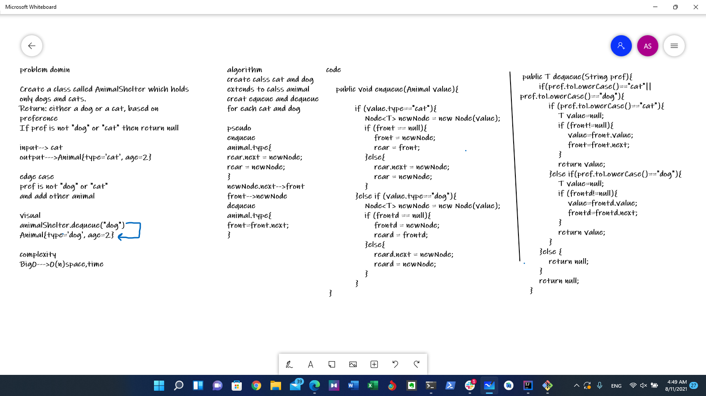

# stack-queue-animal-shelter
Create a class called AnimalShelter which holds only dogs and cats.
Return: either a dog or a cat, based on preference
If pref is not "dog" or "cat" then return null

## Whiteboard Process

## Approach & Efficiency

Big0-->0(n)space,time