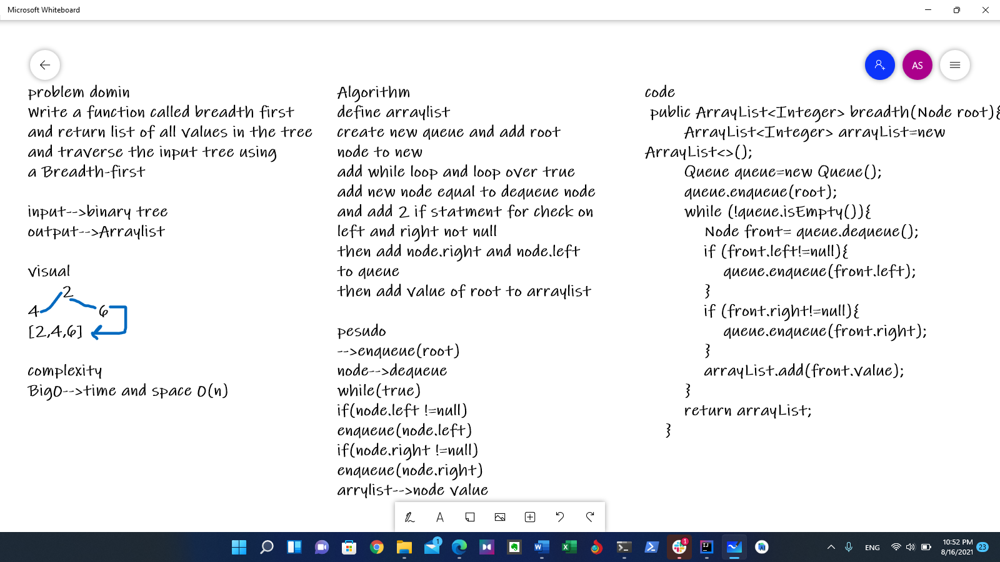

# tree-breadth-first
Write a function called breadth first
and return list of all values in the tree
and traverse the input tree using 
a Breadth-first

## Whiteboard Process

## Approach & Efficiency

Big0-->0(n)space,time