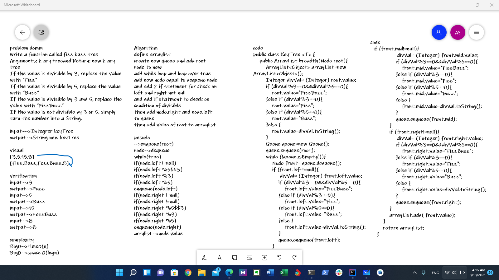

# tree-fizz-buzz
Write a function called fizz buzz tree
Arguments: k-ary treeand Return: new k-ary tree
If the value is divisible by 3, replace the value with “Fizz”
If the value is divisible by 5, replace the value with “Buzz”
If the value is divisible by 3 and 5, replace the value with “FizzBuzz”
If the value is not divisible by 3 or 5, simply turn the number into a String.

## Whiteboard Process

## Approach & Efficiency

Big0-->time0(n)
Big0-->space 0(logn)